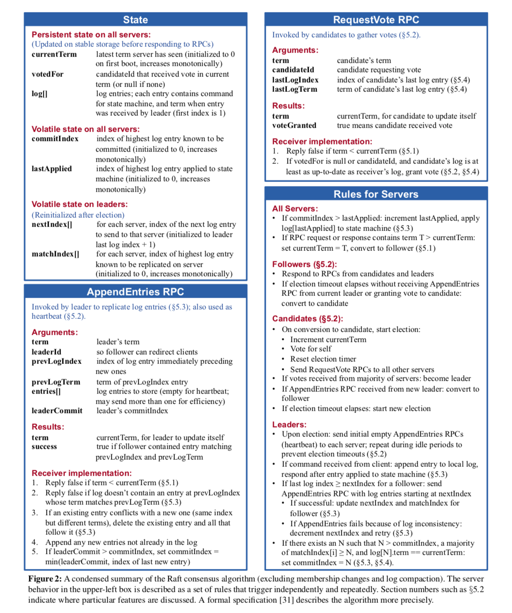

# 基于 Go 的 Raft 实现报告

## Raft 简介

Raft 是一种分布式共识算法，设计目的是实现分布式系统中节点间的一致性（例如，在分布式数据库或分布式系统中对日志或状态的复制）。Raft 算法的主要目标是易于理解和实现，同时保证与 Paxos 等传统共识算法一样的鲁棒性和性能。

Raft 系统中的每个节点（Raft peer）可以扮演以下三种角色之一：
- **Leader（领导者）**：
  负责接收客户端的请求并将操作日志同步到其他节点。系统通常保持一个唯一的 Leader。
- **Follower（跟随者）**：
  被动地响应来自 Leader 或候选者的请求，主要接收和复制日志。
- **Candidate（候选者）**：
  在 Leader 不可用时，Follower 可以转为 Candidate 并发起选举，尝试成为新的 Leader。

正常情况下（Normal Opertation phase）raft 系统有 $1$ 个 leader 以及 $n-1$ 个 Follower。如果 Follower 在一个“选举超时时间”内未收到来自 Leader 的心跳，它会发起选举成为 Candidate，并向其他节点请求投票。以下是一些关键机制

**Term（任期）**
 - Raft 将时间划分为任期，使用递增的任期号来识别不同的领导周期。


<center color=grey size=1px>
图片来于 Assignment PPT
</center>

**Leader 选举**
- 当某个 Follower 成为 Candidate 时，会增加自己维护的任期号（term）并广播投票请求（RequestVote）。每个节点的选举超时时间是随机的，避免多个节点同时发起选举。
  - 如果收到 Leader 的消息，则返回 Follower 状态。
  - 如果收到大多数 peer 的投票，则成为新的 Leader。
  - 如果没有收到任何 Candidate 赢得选举的消息，则增加任期号（term），重新发起选举。
- 收到广播投票请求（RequestVote）后，每个节点只能在同一个任期内向某一个 Candidate 投一票，投票后等待多数投票结果。
- 当 Candidate 获得多数节点投票时，成为 Leader，并且更新所有 Follower 的日志。新 Leader 的日志必须包含已提交的所有日志条目。

**日志复制**
- Leader 将客户端请求转化为日志条目，并将其复制到所有 Follower（AppendEntries）。
  - Leader 提交日志时附带上一条日志的索引（index）和任期号（term），确保日志顺序一致。
  - Follower 校验日志连续性，若发现不一致，拒绝日志并要求重新发送。
- 一旦日志被多数节点确认，Leader 会标记日志为已提交，并通知 Follower 应用该日志。


<center color=grey size=1px>
图片来于 Assignment PPT
</center>

## 建立实验环境

实验所用设备为一台搭载 Ubuntu 24.04 操作系统的物理机。

输入命令，建立实验环境
```				DPrintf("%v receive reply && %v %v", rf, rf.next_index, rf.match_index)

snap install go
git clone https://github.com/Zhang-Xiaoda/NJU-DisSys-2017.git
```

安装 go 语言编译器，并且将课程 lab 代码下载到本地。然后按照 Assignment PPT 上的单元测试要求，编写 `Makefile` 文件，进行冒烟测试。

```makefile
export GO111MODULE=off
export GOPATH = $(PWD)

run_ass1:
	cd src/raft && go test -run Election

run_ass2:
	cd src/raft && go test -run FailNoAgree 
	cd src/raft && go test -run ConcurrentStarts
	cd src/raft && go test -run Rejoin
	cd src/raft && go test -run Backup

run_ass3:
	cd src/raft && go test -run Persist1
	cd src/raft && go test -run Persist2
	cd src/raft && go test -run Persist3
```

运行 Makefile 脚本。


成功运行了单元测试，表明实验环境搭建完成。

## 分析 lab 的代码架构

课程 lab 提供的初始代码框架，其中 `/src/raft` 下包含 $5$ 个文件。

 - `config.go`, `test_test.go` 包含了 lab 提供的单元测试。
 - `persister.go` 提供了数据结构 `Persister`，用于保存 raft 快照，可以修改其内容以辅助 debug。`util.go` 提供了 debug 用的函数。
 - `raft.go` 包含了 raft 算法的主要部分，也是本次 lab 主要需要实现的部分。

`raft.go` 的代码框架如下。

- **节点状态维护**：每个节点(peer)运行一个 Raft 实例，并保持自己的状态。
    ```go
    type Raft struct {
        // 给定了一部分，其他要求自己填充
    }

    // 一个只读方法，用于外部服务获取当前节点的任期号和领导者状态。
    func (rf *Raft) GetState() (int, bool) { /*要求实现*/ }

    // 初始化一个 Raft 节点实例，创建独立的 goroutine 来处理长期任务。
    func Make(peers []*labrpc.ClientEnd, me int, persister *Persister, applyCh chan ApplyMsg) *Raft { /*要求实现*/ }

    // 关闭节点的调试输出或清理资源。
    func (rf *Raft) Kill() { /*要求实现*/ }
    ```
- **RPC 通信**：节点之间通过 RPC 消息通信。
    ```go
    // RequestVote RPC 的封装
    type RequestVoteArgs struct { /*要求实现*/ }

    type RequestVoteReply struct { /*要求实现*/ }

    func (rf *Raft) RequestVote(args RequestVoteArgs, reply *RequestVoteReply) { /*要求实现*/ }

        func (rf *Raft) sendRequestVote(server int, args RequestVoteArgs, reply *RequestVoteReply) bool {
        ok := rf.peers[server].Call("Raft.RequestVote", args, reply)
        return ok
    }

    // 要求自己补充 AppendEntries RPC
    ```
- **日志和状态持久化**：为了支持节点故障恢复，节点会持久化其状态。
    ```go
    func (rf *Raft) persist() { /*要求实现*/ }
    func (rf *Raft) readPersist(data []byte) { /*要求实现*/ }
    ```
- **Apply 消息**：通过 `ApplyMsg` 将已提交的日志应用到上层服务。
  ```go
    type ApplyMsg struct { /*已给定*/ }
  ```
- **接受用户的指令**
    ```go
    func (rf *Raft) Start(command interface{}) (int, int, bool) { /*要求实现*/ }
    ```

## 实现 Assignment Part 1: Election

Part 1 的目标是完成 Election 的实现。首先我们扩充 Raft 结构体

```go
type Raft struct {
    // 省略 lab 自带的部分...

    node_state   string // "leader", "follower", "candidate"
    current_term int
    voted_for    int
    timer *time.Timer
}
```

前三个字段的定义与原始论文一致，多出来的 `timer` 字段是定时器，用于定时发送 Heartbeat 与 RequestVote。


<center color=grey size=1px>
图片来于 Raft 论文
</center>

然后补充其初始化代码

```go
func Make(peers []*labrpc.ClientEnd, me int,
	persister *Persister, applyCh chan ApplyMsg) *Raft {
    // ...
    // Your initialization code here.
	
    rf.current_term = 0
    rf.voted_for = -1
    rf.node_state = Follower
    rf.timer = time.NewTimer(ElectionTimeout())

    DPrintf("%v wake up", rf)

    // initialize from state persisted before a crash
    rf.readPersist(persister.ReadRaftState())

    go rf.OnTimeout() // 新建 routine，用于处理计时器事件
    return rf
}
```

而计时器事件的处理函数逻辑如下
 - 如果当前为 Leader 节点，则调用 `broadcastHeartbeat` 函数用于广播心跳包；否则调用 `raiseElection` 函数发起选举。

```go
// 定义两种事件 timeout，其中 ElectionTimeout 需要随机化
func HearbeatTimeout() time.Duration {
	return time.Duration(50) * time.Millisecond
}

func ElectionTimeout() time.Duration {
	return time.Duration(150+rand.Intn(150)) * time.Millisecond
}

func (rf *Raft) OnTimeout() {
	for {
		select {
		case <-rf.timer.C:
			rf.mu.Lock()

			if rf.node_state == Leader {
				rf.broadcastHeartbeat()
				rf.timer.Reset(HearbeatTimeout())
			} else {
				rf.changeToCandidate()
				rf.raiseElection()
				rf.timer.Reset(ElectionTimeout())
			}

			rf.mu.Unlock()
		}
	}
}
```

心跳包的广播使用了 `AppendEntries` RPC，这里我们不考虑传递有效 payload，只传递 Term 用于对齐时序。

 - Corner Case 当收到 `AppendEntries` 发送的心跳包的时候，如果对方的 `Term` 比较小，则返回 false。否则自己需要变成 `Follower`。

```go
type AppendEntriesArgs struct {
	Term int
}

type AppendEntriesReply struct {
	Term    int
	Success bool
}

func (rf *Raft) AppendEntries(args AppendEntriesArgs, reply *AppendEntriesReply) {
	rf.mu.Lock()
	defer rf.mu.Unlock()

	DPrintf("%v receive heartbeat from Leader[Term=%v]", rf, args.Term)

	if args.Term < rf.current_term {
		reply.Term = rf.current_term
		reply.Success = false

		return
	} else {
		rf.changeToFollower(args.Term)

		reply.Term = rf.current_term
		reply.Success = true

		return
	}
}

func (rf *Raft) sendAppendEntries(server int, args AppendEntriesArgs, reply *AppendEntriesReply) bool {
	ok := rf.peers[server].Call("Raft.AppendEntries", args, reply)
	return ok
}
```

`broadcastHeartbeat` 的函数实现为为所有的 RPC 都新建了一个 routine
 - Corner case：如果收到一个比自己大的 `Term`，则变回 `Follower`。

```go
func (rf *Raft) broadcastHeartbeat() {
	DPrintf("%v broadcast heartbeat", rf)

	for peer := range rf.peers {
		if peer != rf.me {
			go func(peer int) {
				var reply AppendEntriesReply
				if !rf.sendAppendEntries(
					peer,
					AppendEntriesArgs{Term: rf.current_term},
					&reply,
				) {
					return
				}

				rf.mu.Lock()

				if reply.Term > rf.current_term {
					DPrintf(
						"%v find a new leader Node[%v, Term = %v]",
						rf, peer, reply.Term,
					)
					rf.changeToFollower(reply.Term)
				}

				rf.mu.Unlock()
			}(peer)
		}
	}
}
```

`raiseElection` 则需要调用 `RequestVote` RPC，这里我们在满足原始论文要求条件下，最小化实现。

 - 实现细节：如果已经投票了或者发起请求的 `Term` 比自己小，则拒绝投票。否则接受投票，并且变回 `Follower`。

```go
type RequestVoteArgs struct {
	Term        int
	CandidateID int
}

// example RequestVote RPC reply structure.
type RequestVoteReply struct {
	Term        int
	VoteGranted bool
}

// example RequestVote RPC handler.
func (rf *Raft) RequestVote(args RequestVoteArgs, reply *RequestVoteReply) {
	rf.mu.Lock()
	defer rf.mu.Unlock()

	DPrintf("%v receive a vote request from Node[%v, Term = %v]", rf, args.CandidateID, args.Term)

	if rf.voted_for == 1 || args.Term <= rf.current_term {
		//DPrintf("%v reject to vote to Node[%v, Term = %v]", rf, args.CandidateID, args.Term)

		reply.Term = rf.current_term
		reply.VoteGranted = false
	} else {
		//DPrintf("%v vote to Node[%v, Term = %v]", rf, args.CandidateID, args.Term)

		rf.changeToFollower(args.Term)
		rf.voted_for = args.CandidateID

		reply.Term = rf.current_term
		reply.VoteGranted = true
	}
}

func (rf *Raft) sendRequestVote(server int, args RequestVoteArgs, reply *RequestVoteReply) bool {
	ok := rf.peers[server].Call("Raft.RequestVote", args, reply)
	return ok
}
```

同样的，对于 `raiseElection` 为所有的 RPC 都新建了一个 routine。

 - 实现细节：如果 `sendRequestVote` 返回的 `Term` 大于自己，则变回 `Follower`，如果自己获得了一半以上的 vote 则变回 Leader，注意要解除 `rf.mu` 的锁定。
  
```go
func (rf *Raft) raiseElection() {
	DPrintf("%v raise an election", rf)
	grantedVotes := 1
	rf.voted_for = rf.me

	for peer := range rf.peers {
		if peer != rf.me {
			go func(peer int) {
				var reply RequestVoteReply
				if !rf.sendRequestVote(
					peer,
					RequestVoteArgs{CandidateID: rf.me, Term: rf.current_term},
					&reply,
				) {
					return
				}

				DPrintf("%v receive vote reply [%v, %v]", rf, reply.Term, reply.VoteGranted)

				rf.mu.Lock()
				defer rf.mu.Unlock()

				if reply.Term > rf.current_term {
					rf.changeToFollower(reply.Term)
				}

				if rf.node_state == Candidate && reply.VoteGranted {
					grantedVotes += 1

					if grantedVotes > len(rf.peers)/2 {
						DPrintf("%v win election", rf)

						defer rf.changeToLeader()
					}
				}
			}(peer)
		}
	}
}
```

运行单元测试结果如下


日志输出


结果表明通过了 Part 1 的单元测试。

## 实现 Assignment Part 2: Log Consensus

Part 2 的任务是实现日志的提交，写入，并保证数据一致性。首先增加了 `Raft` 结构体的字段

```go
type Raft struct {
	// ...

	applyCh chan ApplyMsg

	logs         []Entry
	commit_index int
	last_applied int
	next_index   []int
	match_index  []int

	// ...
}
```

其中 applyCh 是用于向数据库提交 Entry 的接口。其余的字段与 raft 原始论文中的一致。

之后主要需要修改的是 `AppendEntry` RPC。

```go
type AppendEntriesArgs struct {
	// 省略之前的部分

	LeaderID     int
	PrevLogIndex int
	PrevLogTerm  int
	Entries      []Entry
	LeaderCommit int
}

type AppendEntriesReply struct {
	// 省略之前的部分

	ConflictIndex int
}
```

这里按照 Raft 原始论文的要求，增加了一些字段，用于 Leader 向 Follower 推送数据，并且保证一致性。除此，之外，在返回值中额外增加了一个 `ConflictIndex` 字段，用于优化数据对齐的速度：原始论文中每次让 `rf.next_index -= 1` 的方法效率过低，这里我们让 Follower 查询该 Term 最早的一个 index，提示 Leader 从这里开始。然后修改 `broadcastHeartbeat` 的实现

 - 增加了 payload 以及处理 `next_index` 以及 `match_index` 的逻辑。
 - 当 `match_index=next_index-1` 时，发送有效 entries（最多 10 个），否则只发送 `PrevLogIndex`, `PrevLogTerm`, `LeaderCommitIndex` 用于查询最早的同步位置。

```go
func (rf *Raft) broadcastHeartbeat() {
	DPrintf("%v broadcast heartbeat", rf)

	for peer := range rf.peers {
		if peer == rf.me {
			continue
		}
		go func(peer int) {
			rf.mu.Lock()
			var reply AppendEntriesReply
			var entries = make([]Entry, 0)
			var next = rf.next_index[peer]

			if rf.match_index[peer] == rf.next_index[peer]-1 {
				next = min(next+10, len(rf.logs))
				entries = rf.logs[rf.next_index[peer]:next]
			}
			rf.mu.Unlock()

			if !rf.sendAppendEntries(
				peer,
				AppendEntriesArgs{
					Term:         rf.current_term,
					LeaderID:     rf.me,
					LeaderCommit: rf.commit_index,
					PrevLogIndex: rf.logs[rf.next_index[peer]-1].Index,
					PrevLogTerm:  rf.logs[rf.next_index[peer]-1].Term,
					Entries:      entries,
				},
				&reply,
			) {
				return
			}

			rf.mu.Lock()

			if reply.Term > rf.current_term {
				// 同之前 ...
			} else if !reply.Success {
				rf.next_index[peer] = reply.ConflictIndex
			} else {
				rf.next_index[peer] = next
				rf.match_index[peer] = rf.next_index[peer] - 1
			}

			rf.mu.Unlock()
		}(peer)
	}
```

然后 `AppendEntry` RPC 的接收端也进行了相应的修改

 - 增加了判断日志是否同步的逻辑。如果同步则覆写，否则返回一个预测位置。
  
```go
func (rf *Raft) AppendEntries(args AppendEntriesArgs, reply *AppendEntriesReply) {
	rf.mu.Lock()
	defer rf.mu.Unlock()

	// 省略 Part1 的部分...

	if args.PrevLogIndex > rf.LastLogIndex() {
		reply.Success = false
		reply.ConflictIndex = len(rf.logs)

		return
	}

	if rf.logs[args.PrevLogIndex].Term != args.PrevLogTerm {
		reply.Success = false

		for i := args.PrevLogIndex; i >= 0; i-- {
			if rf.logs[args.PrevLogIndex] != rf.logs[i] {
				reply.ConflictIndex = i + 1
				break
			}
		}

		return
	}

	rf.logs = rf.logs[:args.PrevLogIndex+1]
	rf.logs = append(rf.logs, args.Entries...)

	rf.commit_index = min(rf.LastLogIndex(), args.LeaderCommit)

	reply.Term = rf.current_term
	reply.Success = true
}

```

为了保证日志 `apply` 以及 `commit` 的及时性，在 `Make` 中增加了两个 routine 的触发

```go
func Make(peers []*labrpc.ClientEnd, me int,
	persister *Persister, applyCh chan ApplyMsg) *Raft {
	// ...
	
	// 新字段初始化
	rf.logs = make([]Entry, 1)
	rf.commit_index = 0
	rf.last_applied = 0
	rf.next_index = make([]int, len(rf.peers))
	rf.match_index = make([]int, len(rf.peers))

	rf.timer = time.NewTimer(ElectionTimeout())

	// ...

	// 增加了两个新协程
	go rf.apply()
	go rf.leaderCommit()

	return rf
}
```

这两个携程都使用定时触发的方法，`apply` 协程用于向数据库提交已被 commit 的 entries。

```go
func (rf *Raft) apply() {
	for {
		time.Sleep(10 * time.Millisecond)
		rf.mu.Lock()

		if rf.last_applied < rf.commit_index {
			DPrintf("%v appling entry[%v-%v]", rf, rf.last_applied+1, rf.commit_index)

			for i := rf.last_applied + 1; i <= rf.commit_index; i++ {
				rf.applyCh <- ApplyMsg{Index: i, Command: rf.logs[i].Command}
				rf.last_applied = i
			}
		}

		rf.mu.Unlock()
	}
}
```

`leaderCommit` 用于处理 `leader` 的 `commit_index` 的变化，每次更新为所有 `Follower` 的 `match_index` 的中位数。

```go
func (rf *Raft) leaderCommit() {
	for {
		time.Sleep(10 * time.Millisecond)
		rf.mu.Lock()

		if rf.node_state == Leader {
			rf.next_index[rf.me] = len(rf.logs)
			rf.match_index[rf.me] = len(rf.logs) - 1

			var match_index []int = make([]int, len(rf.peers))

			copy(match_index, rf.match_index)
			slices.Sort(match_index)

			if rf.commit_index != match_index[len(rf.peers)/2] {
				DPrintf("%v commit to entry %v", rf, rf.commit_index)

				rf.commit_index = match_index[len(rf.peers)/2]
			}
		}

		rf.mu.Unlock()
	}
}
```

修改后，运行 `BasicAgree` 测试，得到结果


运行 Assignment Part 2 的其他测试，得到结果


至此，我们已经完成了日志一致性的实现。

## 实现 Assignment Part 3: Persist

第三个任务比较简单，只需要实现数据的持久化（即写回硬盘，保证重启后继续正确运行），直接按照论文要求，实现 `persist` 以及 `readPersist` 函数，然后在 `appendEntry` 以及 `start` 的最后调用 `persist` 即可。

```go
func (rf *Raft) persist() {
	w := new(bytes.Buffer)
	e := gob.NewEncoder(w)
	e.Encode(rf.current_term)
	e.Encode(rf.voted_for)
	e.Encode(rf.logs)
	data := w.Bytes()
	rf.persister.SaveRaftState(data)
}
```

```go
func (rf *Raft) readPersist(data []byte) {
	r := bytes.NewBuffer(data)
	d := gob.NewDecoder(r)
	d.Decode(&rf.current_term)
	d.Decode(&rf.voted_for)
	d.Decode(&rf.logs)
}
```

实验结果


## 总结

本实验根据 lab 代码以及 raft 的原始论文的一步步引导，用较为简单清晰的方式实现了 raft 机制最为关键的 Election, Log Consensus, Persist 功能，并且通过了要求的所有单元测试。一些可能改进的地方有

 - 将 `apply` 以及 `leaderCommit` 的轮询改进为异步机制。
 - 使用数据结构（例如平衡树）优化 Log 的查询。