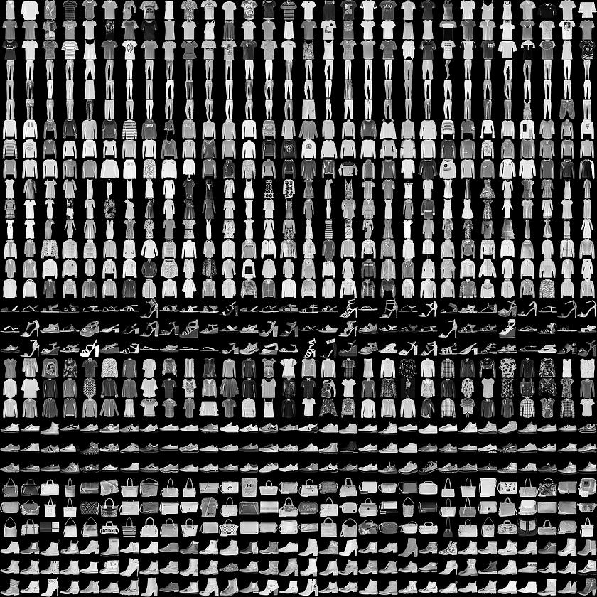
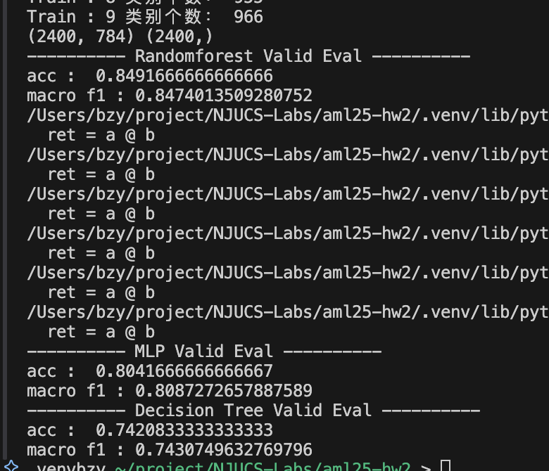
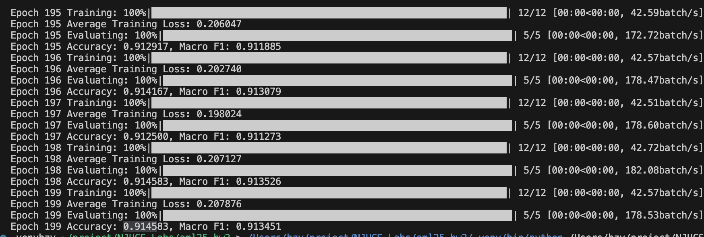

# 高级机器学习第二次作业：基于 Fashion-MNIST 的弱监督图像分类

- [高级机器学习第二次作业：基于 Fashion-MNIST 的弱监督图像分类](#高级机器学习第二次作业：基于fashion-mnist的弱监督图像分类)
    - [1 对 Fashion‑MNIST 数据集的理解与分析](#1 对-fashion‑mnist数据集的理解与分析)
    - [2 评估指标](#2 评估指标)
  - [2. 算法的动机和背景介绍](#2算法的动机和背景介绍)
    - [2.1 动机](#2-1动机)
    - [2.2 背景技术](#2-2背景技术)
      - [2.2.1 卷积神经网络 (CNN)](#2-2-1卷积神经网络-cnn)
      - [2.2.2 伪标签 (Pseudo-Labeling)](#2-2-2伪标签-pseudo-labeling)
      - [2.2.3 数据增强 (Data Augmentation)](#2-2-3数据增强-data-augmentation)
      - [2.2.4 Dropout](#2-2-4-dropout)
      - [2.2.5 批量归一化 (Batch Normalization)](#2-2-5批量归一化-batch-normalization)
      - [2.2.6 注意力机制 (Squeeze-and-Excitation Block, SEBlock)](#2-2-6注意力机制-squeeze-and-excitation-block-seblock)
      - [2.2.7 残差连接 (Residual Connections)](#2-2-7残差连接-residual-connections)
      - [2.2.7 优化器与学习率调度](#2-2-7优化器与学习率调度)
        - [2.2.7.1 Adam优化器](#2-2-7-1-adam优化器)
        - [2.2.7.2 余弦退火学习率 (CosineAnnealingLR)](#2-2-7-2余弦退火学习率-cosineannealinglr)
        - [2.2.7.3 指数移动平均 (Exponential Moving Average, EMA)](#2-2-7-3指数移动平均-exponential-moving-average-ema)
  - [3. 算法的完整技术细节](#3算法的完整技术细节)
    - [3.1 模型架构 (NekoNet)](#3-1模型架构-nekonet)
    - [3.2 数据处理与增强](#3-2数据处理与增强)
    - [3.3 训练过程](#3-3训练过程)
      - [3.3.1 伪标签（Pseudo‑Labeling）策略](#3-3-1 伪标签（pseudo‑labeling）策略)
    - [3.4 算法伪代码](#3-4算法伪代码)
  - [4. 实验结果与分析](#4实验结果与分析)
    - [4.1 性能对比](#4-1性能对比)
    - [4.2 本模型性能分析](#4-2本模型性能分析)
    - [4.3 潜在问题与讨论](#4-3潜在问题与讨论)
  - [5. 结论和讨论](#5结论和讨论)
    - [5.1 结论](#5-1结论)
    - [5.2 未来可改进方向：](#5-2未来可改进方向：)
  - [6. 运行指南](#6运行指南)
    - [6.1 环境配置](#6-1环境配置)
    - [6.2 训练模型](#6-2训练模型)
    - [6.3 生成预测文件](#6-3生成预测文件)
  - [7. 文件结构](#7文件结构)

本次任务是基于 Fashion-MNIST 数据集的弱监督图像分类任务，但其特殊性在于训练数据是弱监督的。具体来说，我们拥有：
*   **有标签数据**：``12,000`` 张图片，``10`` 个类别，每类 ``1,200`` 张，提供了明确的标签。
*   **无标签数据**：``48,000`` 张图片，每类约 ``4,800`` 张，未提供标签，但要求算法充分利用这部分数据。
*   **测试数据**：``10,000`` 张图片，需要我们预测其类别。
所有图像均为 ``28\times 28`` 像素的 ``8`` 位灰度图。

最终评估指标为 Macro F1 Score。


### 1 对 Fashion‑MNIST 数据集的理解与分析

Fashion‑MNIST 由 $10$ 类常见服饰组成，包括上衣、裤装、鞋履与包袋等。与传统 MNIST 手写数字相比，它在视觉层次上更接近真实场景：不仅类别之间差异更为细腻，而且同一类别内部也呈现出丰富的款式变化。具体而言，“套衫 (Pullover)”“外套 (Coat)”与“衬衫 (Shirt)”常因轮廓相似而产生混淆；“运动鞋 (Sneaker)”与“踝靴 (Ankle boot)”在某些角度下亦难以区分。这种类间相似性要求模型具备细粒度的判别能力，而类内差异又要求它能学习到充分而具有代表性的特征。



数据以 $28 \times 28$ 像素灰度图形式呈现，缺乏颜色信息，仅保留服饰的形状、边缘与粗略纹理。有限的分辨率迫使算法从紧凑的像素分布中提取最能区分类别的结构信息。训练集 $60,000$ 张、测试集 $10,000$ 张的规模适中；在本任务中，只有 $12,000$ 张带标签，其余为无标签样本，但整体保持类别均衡。这为弱监督学习算法提供了良好实验土壤：一方面可以利用无标签数据丰富表征，另一方面又无需应对类别失衡带来的偏置。

相较 MNIST 的数字识别任务，Fashion‑MNIST 在视觉复杂度上显著提升，因此常被用作更具挑战性的基准。模型若想在此数据集上取得优异表现，需要同时解决以下关键问题：

* **利用无标签数据**：应设计稳健的伪标签或一致性正则化策略，避免错误标签的累积放大。
* **细粒度特征提取**：需在低分辨率条件下捕捉轮廓细节与局部纹理，尤其关注易混类别的边界特征。
* **泛化与正则化**：面对有限的有标签样本，应通过数据增强、权重衰减或半监督对抗训练等手段抑制过拟合，并提升模型在未知测试集上的稳健性。

### 2 评估指标

作业采用 **Macro F1 Score** 作为唯一评估标准。该指标对每个类别一视同仁，先分别计算各类的 F1，再取算术平均。因此，模型必须在全部 10 个类别上都维持一致且优良的召回率与精确率，而不能偏向于某些易于区分的类别。这种评估方式强化了对弱势类别的关注，也凸显了细粒度特征学习的重要性。


## 2. 算法的动机和背景介绍

### 2.1 动机
面对大量的无标签数据，传统的纯监督学习方法无法有效利用。为了克服这一限制，我们转向半监督学习（Semi-Supervised Learning, SSL）领域。其核心思想是结合有标签数据和无标签数据共同训练模型，以期达到比单独使用有标签数据更好的性能。
对于图像分类任务，卷积神经网络（CNN）因其强大的特征提取能力而被广泛应用。因此，我们选择构建一个基于CNN的半监督学习模型。

### 2.2 背景技术

#### 2.2.1 卷积神经网络 (CNN)
卷积神经网络作为图像特征提取的基础架构。通过卷积层、池化层和全连接层等组件，CNN 能够自动学习图像中的层次化特征，从低级的边缘、纹理到高级的物体部件和整体形状。本项目设计了一个自定义的CNN模型（NekoNet）。

#### 2.2.2 伪标签 (Pseudo-Labeling)
伪标签是一种简单而有效的半监督学习方法。模型首先在有标签数据 ``D_L = \{(x_l, y_l)\}`` 上训练。然后，用训练好的模型 $f(\cdot; \theta)$ 对无标签数据 $x_u \in D_U$ 进行预测。
预测的类别为：

$$
\hat{y}_u = \underset{k}{\text{argmax}} \; P(y=k | x_u; \theta)
$$

预测的置信度为：

$$ 
p_u = \max_k P(y=k | x_u; \theta) 
$$

如果置信度 $p_u$ 高于某个阈值 $\tau$，则将预测结果 $(\hat{y}_u, x_u)$ 作为“伪标签”样本，加入到训练集中，与原始有标签数据合并，共同用于模型的下一轮训练。

#### 2.2.3 数据增强 (Data Augmentation)
通过对训练图像进行一系列随机变换（如随机水平翻转、随机旋转、随机裁剪等），人为地增加训练数据的多样性。这有助于模型学习到更鲁棒的特征，减少对训练数据中特定模式的过拟合，从而提高模型在未见过数据上的泛化能力。

#### 2.2.4 Dropout
在训练过程中，Dropout 以概率 $p$ 随机地将一部分神经元的输出设置为零（失活）。这意味着在每次前向传播和反向传播中，网络结构都会有所不同。这迫使网络学习冗余的表示，减少了神经元之间的复杂共适应关系，从而防止模型对训练数据中的特定特征或噪声过度依赖。在测试时，通常不使用 Dropout，或者对权重进行相应的缩放（乘以 $1-p$）。

#### 2.2.5 批量归一化 (Batch Normalization)
批量归一化对神经网络中每一层的输入（或激活值）在每个 mini-batch 内进行归一化处理。对于一个 mini-batch 的激活值 $x_i$：
1.  计算均值：$\mu_B = \frac{1}{m} \sum_{i=1}^m x_i$
2.  计算方差：$\sigma_B^2 = \frac{1}{m} \sum_{i=1}^m (x_i - \mu_B)^2$
3.  归一化：$\hat{x}_i = \frac{x_i - \mu_B}{\sqrt{\sigma_B^2 + \epsilon}}$
4.  缩放和平移：$y_i = \gamma \hat{x}_i + \beta$
其中 $m$ 是 mini-batch 的大小，$\epsilon$ 是一个很小的常数以保证数值稳定性，$\gamma$ 和 $\beta$ 是可学习的参数。BN 不仅加速了模型收敛，提高了训练稳定性，还因其在训练时引入的噪声（每个 mini-batch 的均值和方差不同）而具有一定的正则化效果。

#### 2.2.6 注意力机制 (Squeeze-and-Excitation Block, SEBlock)
SEBlock 是一种通道注意力机制，它显式地建模了特征通道之间的相互依赖关系，通过学习各个特征通道的重要性，对有用的特征通道赋予更高的权重，抑制无用的通道。
对于输入特征图 $U \in \mathbb{R}^{H \times W \times C}$，SEBlock 的操作如下：
1.  **Squeeze (全局信息嵌入)**：通过全局平均池化将每个通道的空间信息压缩成一个标量描述符 $z \in \mathbb{R}^{C}$。
    $$ 
    z_c = F_{sq}(u_c) = \frac{1}{H \times W} \sum_{i=1}^H \sum_{j=1}^W u_c(i,j) 
    $$
2.  **Excitation (自适应校准)**：通过两个全连接层（通常第一个是降维，第二个是升维）和一个 Sigmoid 激活函数来学习通道间的非线性依赖关系，并生成每个通道的权重 $s \in \mathbb{R}^{C}$。
    $$
    s = F_{ex}(z, W) = \sigma(W_2 \delta(W_1 z))
    $$
    其中 $\delta$ 是 ReLU 激活函数，$\sigma$ 是 Sigmoid 激活函数，$W_1 \in \mathbb{R}^{\frac{C}{r} \times C}$，$W_2 \in \mathbb{R}^{C \times \frac{C}{r}}$，$r$ 是缩减率。
3.  **Scale (特征重标定)**：将学习到的通道权重 $s_c$ 乘到原始特征图 $u_c$ 上。
    $$ 
    \tilde{x}_c = F_{scale}(u_c, s_c) = s_c \cdot u_c
    $$
    其中 $\tilde{x}_c$ 是 SEBlock 的输出特征图的一个通道。

#### 2.2.7 残差连接 (Residual Connections)
残差连接允许信息（通常是输入）直接跨越一层或多层传播到更深的层。如果一个块的输入是 $x$，期望学习的映射是 $H(x)$，那么残差块学习的是残差函数 $F(x) = H(x) - x$。因此，块的输出变为：

$$
y = F(x, \{W_i\}) + x
$$

这种结构使得网络更容易学习恒等映射（即 $F(x)=0$），有助于训练非常深的网络，缓解了梯度消失问题，并能提升模型性能。

#### 2.2.7 优化器与学习率调度

##### 2.2.7.1 Adam优化器
Adam (Adaptive Moment Estimation) 是一种结合了 Momentum 和 RMSprop 思想的自适应学习率优化算法。它为每个参数计算独立的自适应学习率。
在时间步 $t$，给定梯度 $g_t = \nabla_\theta J(\theta_t)$：
1.  更新有偏一阶矩估计（动量）：
    $$
    m_t = \beta_1 m_{t-1} + (1-\beta_1) g_t
    $$
2.  更新有偏二阶矩估计（平方梯度）：
    $$
    v_t = \beta_2 v_{t-1} + (1-\beta_2) g_t^2
    $$
3.  计算偏差校正后的一阶矩估计：
    $$ 
    \hat{m}_t = \frac{m_t}{1-\beta_1^t}
    $$
4.  计算偏差校正后的二阶矩估计：
    $$
    \hat{v}_t = \frac{v_t}{1-\beta_2^t}
    $$
5.  更新参数：
    $$
    \theta_{t+1} = \theta_t - \frac{\eta}{\sqrt{\hat{v}_t} + \epsilon} \hat{m}_t
    $$
其中 $\eta$ 是学习率，$\beta_1, \beta_2$ 是衰减率（通常接近1），$\epsilon$ 是一个小的平滑项。

##### 2.2.7.2 余弦退火学习率 (CosineAnnealingLR)
余弦退火学习率调度器根据余弦函数的形状周期性地调整学习率。在一个周期内，学习率从初始值 $\eta_{max}$ 平滑地下降到 $\eta_{min}$（通常为0）。
对于当前周期内的迭代步数 $T_{cur}$ 和总迭代步数 $T_{max}$，学习率 $\eta_t$ 计算如下：
$$ 
\eta_t = \eta_{min} + \frac{1}{2}(\eta_{max} - \eta_{min})\left(1 + \cos\left(\frac{T_{cur}}{T_{max}}\pi\right)\right)
$$
这种调度策略有助于模型在训练后期更好地探索损失函数的局部最小值，并可能在训练结束时收敛到更好的解。

##### 2.2.7.3 指数移动平均 (Exponential Moving Average, EMA)
EMA 是一种对模型参数进行平滑的技术。它维护一组“影子”参数，这些参数是模型实际参数的滑动平均值。在每次训练迭代后，EMA 参数 $\theta'_{EMA}$ 更新如下：
$$
\theta'_{EMA, t} = \alpha \cdot \theta'_{EMA, t-1} + (1-\alpha) \cdot \theta_t
$$
其中 $\theta_t$ 是当前训练步骤的模型参数，$\alpha$ 是衰减率（一个接近1的常数，例如0.999）。在评估或最终部署时，使用 EMA 参数通常能得到一个在验证集和测试集上表现更稳定、泛化能力更强的模型。

## 3. 算法的完整技术细节

### 3.1 模型架构 (NekoNet)

模型 `NekoNet` 的具体结构定义在 `model.py` 中，NekoNet 以“**浅层主干 + 注意力模块 + 轻量残差**”为设计原则：

* 第一卷积块（`conv1` → `bn1` → ReLU → `max‑pool`）完成基础边缘与纹理提取。
* 第二卷积块增加通道数（16 → 32）并接入 **Squeeze‑and‑Excitation（SE）** 注意力模块以重标定特征通道的重要性（代码 `SEBlock`）。
* 引入 1 × 1 卷积与批归一化形成跳连，降低参数量的同时保留信息流，缓解梯度衰减（`skip_conv` + `skip_bn`）。
* 两级 `MaxPool` 将空间尺度降至 7 × 7；扁平化后接全连接层（128 维隐空间）。
* `Dropout` 贯穿卷积与全连接阶段（0.25 / 0.5），与 `BatchNorm` 共同抑制过拟合。

**参数量与深度控制**：网络总深度不足 10 层，参数规模 ≈ 0.7 M，可在 CPU 或低端 GPU 上于数小时内收敛，契合课程/比赛场景的硬件限制。

### 3.2 数据处理与增强
数据加载和预处理逻辑定义在 `dataset.py` 中。不同阶段的数据采用两套转换策略。训练阶段将张量先转换为 PIL 图像，再随机水平翻转并在 $±10°$ 范围内旋转，以增加几何多样性；之后重新调整到 $28 × 28$ 并转回张量，使增强后的样本与原始分辨率一致。验证与测试阶段仅执行尺寸调整与张量化，以确保评估的一致性。有标签与无标签的训练数据共同使用带随机扰动的管线，以减轻分布漂移。

```python
# dataset.py
train_data_transform = transforms.Compose([
    transforms.ToPILImage(),
    transforms.RandomHorizontalFlip(),
    transforms.RandomRotation(5),
    transforms.Resize(image_size),
    transforms.ToTensor()
])
```

### 3.3 训练过程

训练逻辑主要在 `train.py` 中实现，采用了基于伪标签的半监督学习策略。

程序首先实例化 `NekoNet`，并在其参数上附加指数移动平均（EMA），。优化器选用 Adam 配合余弦退火调度器在 200 个 epoch 内逐渐降低学习率。每个 epoch 内，同步迭代一批有标签与一批无标签样本。监督损失由交叉熵直接计算；无监督部分先对无标签样本前向推理。当完成一次反向传播后，Adam 更新网络参数，而 EMA 使用当前权重对其滑动平均。调度器在 epoch 末步进。验证环节采用即时权重评估 Macro F1，以监控训练过程。整个训练结束后，脚本把 EMA 权重覆盖到主网络并存盘为 `dist/final_ema.pt`，该模型也是最终推理使用的版本。


#### 3.3.1 伪标签（Pseudo‑Labeling）策略
在每个 epoch 内，模型先对一批无标签样本生成预测概率 $p(\hat y\mid x)$。若最大置信度 $\max\_k p(k\mid x)\ge\tau$（设 $\tau=0.96$），则把预测结果作为伪标签参与无监督损失：

```math
\mathcal L_{\text{unsup}}
      = \frac1{|\mathcal B_u|}\sum_{x\in\mathcal B_u}
        \mathbf 1[\max p\ge\tau]\;
        \mathrm{CE}\bigl(p(\,\cdot\mid x),\;\hat y\bigr).
```

整体损失

```math
\mathcal L = \mathcal L_{\text{sup}} + \lambda(t)\,\mathcal L_{\text{unsup}},
\quad
\lambda(t)=\min\!\bigl(1,\;t/\text{ramp}\bigr),
```

其中 $t$ 为当前 epoch，**ramp‑up** 长度设置为 $15$，使模型在早期先稳健拟合标签数据，再逐步扩大无监督信号权重。

**3. 优化与学习率调度**

* **Adam**（$lr=10^{-3}$，$w_d=10^{-4}$）负责自适应梯度更新。
* **CosineAnnealingLR** 令学习率余弦式衰减以提升后期细粒度收敛。
* **Exponential Moving Average (EMA)** 对参数做滑动平均（衰减 0.999），在验证与推理阶段导出更平滑的权重。

### 3.4 算法伪代码

```math
\begin{array}{l}
    \hline
    \textbf{Algorithm： } \text{ NekoNet Semi-Supervised Training with Pseudo-Labeling} \\ \hline
    \text{Input: Labeled dataset } \mathcal{D}_L = \{(x_l, y_l)\}, \text{Unlabeled dataset } \mathcal{D}_U = \{x_u\}, \text{Validation dataset } \mathcal{D}_V \\
    \text{Initialize: NekoNet model } (\theta), \text{EMA model } (\theta_{ema}) \text{ with decay } \alpha \\
    \text{Hyperparameters: learning\_rate } (\eta), \text{total\_epochs } (E), \text{batch\_size\_labeled } (B_L), \\
    \quad \text{batch\_size\_unlabeled } (B_U), \text{confidence\_threshold } (\tau), \text{ramp\_up\_duration } (R) \\
    \\
    \text{1 . Optimizer } \leftarrow \text{Adam}(\theta.\text{parameters, lr}=\eta) \\
    \text{2 . Scheduler } \leftarrow \text{CosineAnnealingLR}(\text{Optimizer, } T_{max}=E) \\
    \text{3 . } \textbf{for } \text{epoch} = 1 \text{ to } E: \\
    \text{4 . } \quad \lambda_\text{unsup} \leftarrow \min(1.0, \text{epoch} / R) \quad \text{\# Unsupervised loss weight ramp-up} \\
    \text{5 . } \quad \textbf{while } (x_\text{batchL}, y_\text{batchL}, x_\text{batchU}) \gets \text{get\_batch}(\mathcal{D}_L,\mathcal{D}_U): \\
    \text{6 . } \quad \quad \text{logits}_l \leftarrow \theta(x_\text{batchL}) \\
    \text{7 . } \quad \quad L_\text{sup} \leftarrow \text{CrossEntropyLoss}(\text{logits}_l, y_\text{batchL}) \quad \quad \text{\# Supervised Loss} \\
    \text{8 . } \quad \quad \textbf{with } \text{no\_grad():} \\
    \text{9 . } \quad \quad \quad \text{logits}_{u} \leftarrow \theta(x_\text{batchU}) \\
    \text{10. } \quad \quad \quad \text{probs}_u \leftarrow \text{Softmax}(\text{logits}_{u}) \\
    \text{11. } \quad \quad \quad \text{max\_probs, pseudo\_labels} \leftarrow \text{torch.max}(\text{probs}_u, \text{dim}=-1) \\
    \text{12. } \quad \quad \quad \text{mask} \leftarrow \text{max\_probs.ge}(\tau).\text{float()} \\
    \text{13. } \quad \quad \textbf{if } \text{mask.sum()} > 0: \\
    \text{14. } \quad \quad \quad L_\text{unsup} \leftarrow \text{mean}(\text{CrossEntropyLoss}(\text{logits}_{u}, \text{pseudo\_labels}) * \text{mask}) \\
    \text{15. } \quad \quad \textbf{else}: \\
    \text{16. } \quad \quad \quad L_\text{unsup} \leftarrow \boldsymbol{0} \\
    \text{17. } \quad \quad L_\text{total} \leftarrow L_\text{sup} + \lambda_\text{unsup} * L_\text{unsup} \\
    \text{18. } \quad \quad \text{Optimizer.zero\_grad()} \\
    \text{19. } \quad \quad L_\text{total}.\text{backward()} \\
    \text{20. } \quad \quad \text{Optimizer.step()} \\
    \text{21. } \quad \quad \theta_{ema}.\text{update}(\theta.\text{parameters)} \quad \text{\# Update EMA parameters} \\
    \text{22. } \quad \text{Scheduler.step()} \\
    \text{23. } \quad \text{val\_accuracy, val\_macro\_f1} \leftarrow \text{evaluate\_model}(\theta, \mathcal{D}_V) \\
    \text{24. } \quad \text{print(f"Epoch \{epoch\}: Val Acc: \{val\_accuracy\}, Val Macro F1: \{val\_macro\_f1\}")} \\
    \text{25. } \text{SaveModel}(\theta) \\
    \hline
\end{array}
```

## 4. 实验结果与分析

本章节旨在评估所提出的 NekoNet 模型在 Fashion-MNIST 数据集上的性能，并与提供的基准模型进行对比。所有评估均在验证集上进行。训练过程中的性能监控图像如下所示：


*图 1: 基准模型训练过程中的验证集 Macro F1 Score 变化*


*图 2: NekoNet 模型训练过程中的验证集 Macro F1 Score 变化*

### 4.1 性能对比

表 1 展示了 NekoNet 模型与多种基准模型在验证集上的准确率（Accuracy）和宏 F1 分数（Macro F1 Score）的对比结果。

| Model                | Accuracy | Macro F1 |
|----------------------|----------|----------|
| NekoNet (Epoch 199)  | 91.46%   | 0.9135   |
| Random Forest        | 84.92%   | 0.8474   |
| MLP                  | 80.42%   | 0.8087   |
| Decision Tree        | 74.21%   | 0.7431   |

*表 1: 不同模型在验证集上的性能对比*

### 4.2 本模型性能分析

经过 200个周期的训练，并应用指数移动平均（EMA）策略，本研究中提出的 NekoNet 模型在验证集上取得了 91.46% 的准确率和 0.9135 的Macro F1 分数。

**模型迭代与优化历程**：
1.  **初始架构探索与过拟合问题**：初期实验尝试采用 `ResNet-18` 作为骨干网络。然而，鉴于 Fashion-MNIST 数据集的相对简单性，即使对输入层与池化层进行适配调整，模型仍表现出较强的过拟合趋势。
2.  **轻量级CNN设计 (NekoNet V1)**：为缓解过拟合，重新设计了一个更为轻量级的卷积神经网络结构。该结构包含两个核心卷积模块及全连接层，并集成了批量归一化（`BatchNorm`）与随机失活（`Dropout`）机制，有效提升了训练的稳定性。
3.  **引入注意力机制 (NekoNet V2)**：为增强模型对特征通道的辨别能力，在第二个卷积模块后引入了 Squeeze-and-Excitation (SE) 模块。实验观察到此举加速了模型收敛，但对最终验证集准确率的提升效果有限。
4.  **优化器调整**：将优化算法调整为 Adam，并相应优化了学习率参数，旨在提升优化过程的效率与效果。
5.  **数据增强策略**：为提升模型的泛化能力，在数据预处理阶段（`dataset.py`）对训练样本应用了随机水平翻转和随机旋转等数据增强技术。
6.  **学习率设定**：针对 Adam 优化器，将初始学习率设定为 `0.001`，此为该优化器在类似任务中常用的初始值。
7.  **引入残差连接 (NekoNet V3 - 当前版本)**：为促进更深层次特征的学习并改善梯度在网络中的传播，在第二个卷积模块（已集成SEBlock）周围引入了残差连接。

**与基准模型的比较**：如表 1 所示，本研究实现的 NekoNet 模型（以 Epoch 199 的EMA 权重为例）在验证集上取得了 0.9135 的 Macro F1 分数，显著优于所提供的基准模型，包括随机森林（0.8474）和多层感知机（MLP）（0.8087）。

### 4.3 潜在问题与讨论

尽管经过多轮迭代优化，模型在验证集上的 Macro F1 分数稳定在 0.91 附近，进一步显著提升面临挑战。潜在原因可能包括：
1. 伪标签策略引入的噪声或偏差对模型学习上限构成制约；
2. 当前网络结构对于Fashion-MNIST数据集的表征能力可能已接近其有效容量上限；
3. 超参数组合（如伪标签置信度阈值、损失函数权重等）仍有精细调优的空间；
4. Fashion-MNIST数据集本身的内在类别区分难度。

除此之外实验过程表明，半监督学习中的关键超参数，如伪标签置信度阈值 $\tau$ 以及无监督损失项的权重 ramp-up 周期，对模型的最终性能表现出一定的敏感性，需要通过细致的实验进行调整与验证。

## 5. 结论和讨论

### 5.1 结论
本报告设计并实现了一个名为 `NekoNet` 的卷积神经网络，并结合伪标签、数据增强、EMA等策略进行半监督学习，以解决Fashion-MNIST的弱监督图像分类任务。通过一系列的模型结构优化（引入SEBlock、残差连接）和训练策略调整（优化器选择、学习率调整、数据增强），最终模型在验证集上取得了 0.9135 的 Macro F1 Score，表现优于所提供的多种传统机器学习基线模型。实验结果表明，所提出的方法能够有效利用无标签数据，提升模型的分类性能。

### 5.2 未来可改进方向：

1.  **更先进的半监督算法**：可以尝试如 FixMatch, MixMatch, UDA (Unsupervised Data Augmentation) 等更前沿的半监督学习框架，它们通常在一致性正则化和数据增强方面有更精巧的设计。
2.  **伪标签的改进**：可以研究如何进一步提升伪标签的质量，例如引入课程学习的思想，逐步增加伪标签的难度；或者对伪标签的置信度进行更细致的建模。
3.  **网络结构探索**：虽然当前NekoNet表现尚可，但可以尝试其他轻量级且高效的CNN架构，或者探索更深层的网络结构（需注意过拟合风险）。
4.  **超参数自动优化**：使用如Optuna等工具进行更系统的超参数搜索。

## 6. 运行指南

### 6.1 环境配置
主要依赖库如下 (请根据您的实际环境填写或提供 `requirements.txt`):
*   Python (e.g., 3.9+)
*   PyTorch (e.g., 1.10+)
*   torchvision
*   scikit-learn
*   pandas
*   numpy
*   tqdm
*   torch-ema


### 6.2 训练模型
在项目根目录下运行 `train.py` 脚本。可以指定不同的超参数：
'''bash
python train.py --lr 0.001 --epochs 200 --tau 0.96 --ramp 15 --labeled_batch_size 768 --unlabeled_batch_size 256 --num_workers 2
'''
训练好的模型将保存在 `dist/` 目录下，例如 `dist/final_ema.pt`。

### 6.3 生成预测文件
使用 `predict.py` 脚本加载训练好的模型，并在测试集上进行预测。
'''bash
python predict.py --ckpt dist/final_ema.pt --out example.txt
'''
预测结果将保存在指定的输出文件中 (例如 `example.txt`)，该文件包含 10000 行预测标签。

## 7. 文件结构

```
aml25-hw2/
├── data/                     # 数据集文件夹
│   ├── test_image.csv
│   ├── train_image_labeled.csv
│   ├── train_image_unlabeled.csv
│   └── train_label.csv
├── dist/                     # 输出文件夹 (模型、预测结果)
├── baseline.py               # 基线模型实现 (参考)
├── dataset.py                # 数据加载、预处理和增强
├── device.py                 # 设备配置 (CPU/GPU)
├── model.py                  # NekoNet 模型定义
├── predict.py                # 预测脚本
├── train.py                  # 训练脚本
└── ... (其他配置文件，如 pyproject.toml)
```
